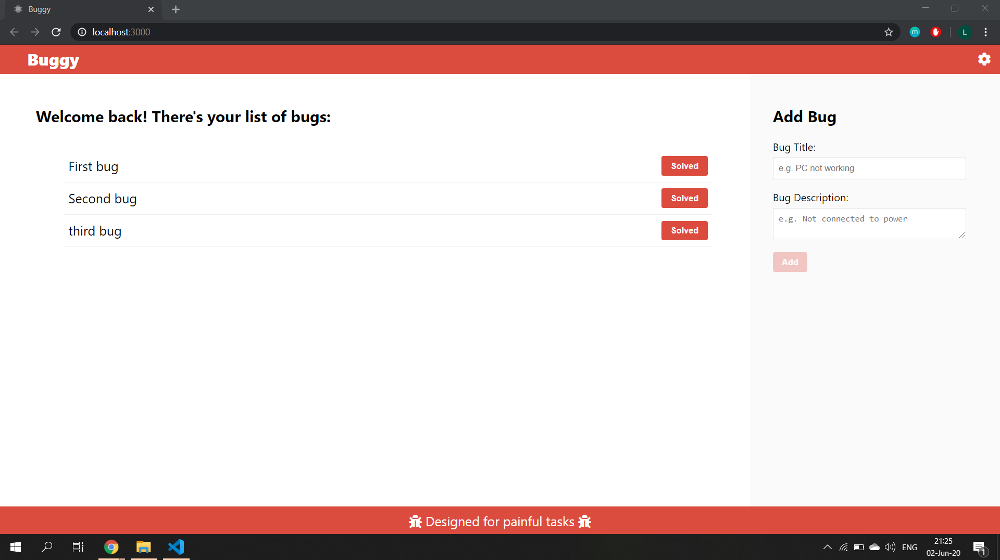

# Buggy

## Proiectul la [laboratorul de tehnici web](https://github.com/WebToLearn/laborator-tehnici-web)
### Tema: Construiti o aplicatie web care respecte criteriile de acceptanta si cerintele de mai jos. Tematica site-ului este la libera alegere.

### Criterii de acceptanta:

- [x] aplicatia sa fie Single Page Application
- [x] codul sursa (nearhivat) al proiectului trebuie sa fie salvat pe GitHub
- [x] nu puteti folosi librarii, framework-uri CSS sau JavaScript (cum ar fi jQuery, Bootstrap, Angular, React, etc) pentru realizarea frontend-ului

## Frontend (maxim 17 puncte)
### HTML si CSS (maxim 8 puncte)
- [x] Fisiere separate pentru HTML si CSS (0.5 puncte)
- [x] In interiorul documentelor HTML, sa se foloseasca minim 4 taguri semantice (1 punct)
- [x] Stilurile CSS sa fie definite folosind clase direct pe elementele care trebuie stilizate (minim 80% din selectori) (0.5 punct)
- [x] Layout-ul sa fie impartit in minim 2 coloane si sa fie realizat cu Flexbox si/sau CSS grid (2 puncte)
- [x] Site-ul sa fie responsive, respectand rezolutiile urmatoarelor dispozitive folosind media queries: (4 puncte)
  - telefon mobil - latime mai mica 768px
  - tableta - latime intre 768px si 1280px
  - desktop - latime mai mare de 1280px
### Javascript (maxim 9 puncte)
- [x] Fisier separat JavaScript (0.5 puncte)
- [x] Manipularea DOM-ului (crearea, editarea si stergerea elementelor/nodurilor HTML) (3 puncte)
- [x] Folosirea evenimentelor JavaScript declansate de mouse/tastatura (1 punct)
- [x] Utilizarea AJAX (GET, POST, PUT, DELETE) (4 puncte)
- [x] Folosirea localStorage (0.5 puncte)
### Backend API (maxim 8 puncte)
- [x] Creare server Backend (2 puncte)
- [x] CRUD API (Create, Read, Update si Delete) pentru a servi Frontend-ului (6 puncte)
